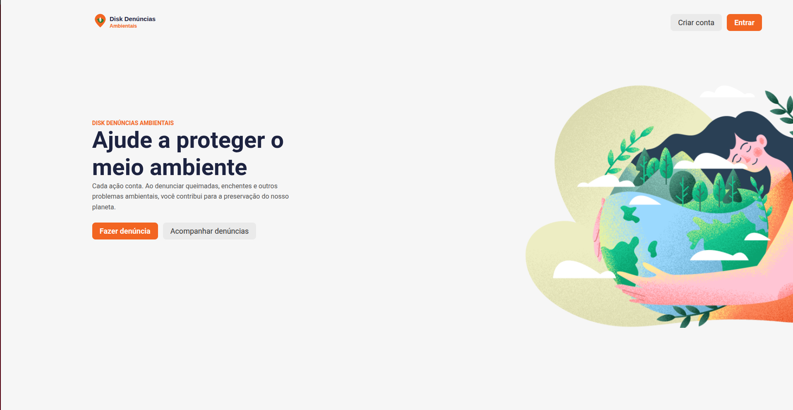

<p align="center">
  
</p>

<h1 align="center">🌿 Disk Denúncias Ambientais — Frontend</h1>

<p align="center">
  Plataforma web para registro, acompanhamento e gestão de denúncias ambientais.<br/>
  Desenvolvido como <strong>Trabalho de Conclusão de Curso (TCC)</strong>.
</p>

<p align="center">
  
  
  
  
  
  
</p>

---

## 📸 Preview

<p align="center">
  
</p>

---

## 📖 Sobre o Projeto

O **Disk Denúncias Ambientais** é uma aplicação full-stack voltada à **proteção do meio ambiente**. Através dela, qualquer cidadão pode registrar denúncias de ocorrências ambientais — como **queimadas**, **alagamentos**, **deslizamentos** e **poluição sonora** — com geolocalização precisa e envio de imagens comprobatórias.

A plataforma permite que o usuário:

- 🔥 **Registre denúncias** em um formulário de duas etapas com validação completa
- 🗺️ **Selecione a localização** via mapa interativo (Leaflet + OpenStreetMap)
- 📷 **Envie até 3 imagens** de evidência por denúncia
- 🔍 **Pesquise e filtre** denúncias por texto, tipo, período e com paginação
- 📋 **Acompanhe suas denúncias** em uma área pessoal ("Minhas Denúncias")
- ✏️ **Edite** denúncias previamente registradas
- 🔐 **Autentique-se** com cadastro e login seguros (JWT)

---

## 🚀 Tecnologias Utilizadas

### Core

| Tecnologia | Versão | Descrição |
|---|---|---|
| [React](https://react.dev/) | 19 | Biblioteca para construção de interfaces reativas |
| [TypeScript](https://www.typescriptlang.org/) | 5.9 | Superset tipado do JavaScript |
| [Vite](https://vitejs.dev/) | 8 | Build tool ultrarrápida com HMR |

### UI & Estilização

| Tecnologia | Descrição |
|---|---|
| [Styled Components](https://styled-components.com/) | CSS-in-JS para componentes estilizados |
| [Material UI (MUI)](https://mui.com/) | Ícones e componentes visuais |
| [Emotion](https://emotion.sh/) | Engine CSS-in-JS utilizada pelo MUI |

### Mapas & Geolocalização

| Tecnologia | Descrição |
|---|---|
| [Leaflet](https://leafletjs.com/) | Biblioteca open-source para mapas interativos |
| [React Leaflet](https://react-leaflet.js.org/) | Wrapper React para Leaflet |
| [OpenStreetMap / Nominatim](https://nominatim.openstreetmap.org/) | Geocodificação reversa gratuita |

### Gerenciamento de Estado

| Tecnologia | Descrição |
|---|---|
| [Redux Toolkit](https://redux-toolkit.js.org/) | Gerenciamento de estado global |
| [React Redux](https://react-redux.js.org/) | Integração Redux com React |

### Formulários & Validação

| Tecnologia | Descrição |
|---|---|
| [Formik](https://formik.org/) | Gerenciamento de formulários |
| [Yup](https://github.com/jquense/yup) | Validação de schemas declarativa |

### Comunicação com Backend

| Tecnologia | Descrição |
|---|---|
| [Axios](https://axios-http.com/) | Cliente HTTP com interceptors para JWT |

### Roteamento

| Tecnologia | Descrição |
|---|---|
| [React Router DOM](https://reactrouter.com/) | Roteamento SPA com navegação declarativa |

---

## 🗂️ Estrutura do Projeto

```
src/
├── assets/                  # Imagens e ilustrações SVG/PNG
├── components/              # Componentes reutilizáveis
│   ├── Loader/              #   Spinner de carregamento
│   ├── LocationInput/       #   Mapa interativo (Leaflet)
│   ├── LogoAmbiental/       #   Logo da aplicação
│   ├── ModalSuccess/        #   Modal de sucesso pós-denúncia
│   ├── Navbar/              #   Barra de navegação
│   ├── Pagination/          #   Paginação dinâmica
│   ├── PrivateRoute/        #   Rota protegida por autenticação
│   ├── ReportCard/          #   Card de denúncia
│   └── ReportDetailModal/   #   Modal de detalhes da denúncia
├── pages/                   # Páginas da aplicação
│   ├── MainPage/            #   Landing page
│   ├── LoginPage/           #   Tela de login
│   ├── RegisterPage/        #   Tela de cadastro
│   ├── FormReport/          #   Formulário etapa 1 (descrição)
│   ├── FormReportDetails/   #   Formulário etapa 2 (localização + fotos)
│   ├── ReportListPage/      #   Listagem pública de denúncias
│   ├── MyReportsPage/       #   Denúncias do usuário logado
│   └── EditReportPage/      #   Edição de denúncia existente
├── router/                  # Configuração de rotas
├── service/                 # Serviços de comunicação com a API
│   ├── api.ts               #   Instância Axios + interceptor JWT
│   ├── authService.ts       #   Login e registro
│   └── reportService.ts     #   CRUD de denúncias
├── store/                   # Redux store
│   ├── index.ts             #   Configuração da store
│   └── slices/
│       ├── authSlice.ts     #   Estado de autenticação
│       └── reportSlice.ts   #   Draft de denúncia (formulário multi-etapas)
├── styles/                  # Estilos globais
│   └── global.ts
├── types/                   # Tipos TypeScript
│   └── report.ts
├── app.tsx                  # Componente raiz
└── main.tsx                 # Ponto de entrada
```

---

## ⚙️ Pré-requisitos

- **Node.js** ≥ 18
- **npm** ou **yarn**
- Backend rodando em `http://localhost:3333` ([ver repositório do backend](../))

---

## 🏁 Como Executar

```bash
# 1. Clone o repositório
git clone https://github.com/seu-usuario/nature-guard-frontend.git
cd nature-guard-frontend

# 2. Instale as dependências
npm install

# 3. Inicie o servidor de desenvolvimento
npm run dev
```

A aplicação estará disponível em **http://localhost:5173**.

### Scripts disponíveis

| Comando | Descrição |
|---|---|
| `npm run dev` | Inicia o servidor de desenvolvimento com HMR |
| `npm run build` | Gera o build de produção (`tsc + vite build`) |
| `npm run preview` | Pré-visualiza o build de produção |
| `npm run lint` | Executa o ESLint no projeto |

---

## 🔗 Integração com o Backend

A aplicação consome uma API REST com os seguintes endpoints principais:

| Método | Endpoint | Descrição |
|---|---|---|
| `POST` | `/auth/register` | Cadastro de usuário |
| `POST` | `/auth/login` | Autenticação (retorna JWT) |
| `GET` | `/reports` | Listagem paginada com filtros |
| `GET` | `/reports/:id` | Detalhes de uma denúncia |
| `POST` | `/reports` | Criação de denúncia (multipart) |
| `PUT` | `/reports/:id` | Atualização de denúncia (multipart) |
| `GET` | `/reports/my-reports` | Denúncias do usuário autenticado |

### Filtros disponíveis na listagem

```
GET /reports?search=queimada&tags=QUEIMADA&startDate=2026-01-01T00:00:00&endDate=2026-04-09T23:59:59&page=0&size=9&sort=createdAt,desc
```

| Parâmetro | Tipo | Descrição |
|---|---|---|
| `search` | `string` | Busca por nome de usuário ou descrição |
| `tags` | `string[]` | Filtra por tipo(s): `QUEIMADA`, `ALAGAMENTO`, `DESLIZAMENTO`, `POLUICAO_SONORA` |
| `startDate` | `ISO datetime` | Data de início do período |
| `endDate` | `ISO datetime` | Data de fim do período |
| `page` | `number` | Número da página (base 0) |
| `size` | `number` | Itens por página |
| `sort` | `string` | Campo e direção de ordenação |

---

## 🎨 Funcionalidades Principais

### 🏠 Landing Page
Página de apresentação com call-to-action para criar denúncias ou acompanhar as existentes.

### 📝 Formulário de Denúncia (2 etapas)
- **Etapa 1:** Título, nome do denunciante (preenchido automaticamente se logado), descrição e seleção do tipo de ocorrência
- **Etapa 2:** Localização via mapa interativo com geocodificação reversa e upload de até 3 imagens

### 🔍 Listagem com Filtros e Paginação
Busca textual, filtro por tipo de ocorrência, filtro por intervalo de datas e paginação fluida inspirada em padrões de mercado.

### 👤 Área do Usuário
Visualização e edição das denúncias do próprio usuário, com identificação via token JWT.

### 🔐 Autenticação
Login e cadastro com validação de formulários, persistência de sessão via `localStorage` e interceptor Axios para envio automático do token.

---

## 📄 Licença

Este projeto foi desenvolvido como **Trabalho de Conclusão de Curso (TCC)** e é de uso acadêmico.

---

<p align="center">
  Feito com 💚 para a proteção do meio ambiente
</p>
